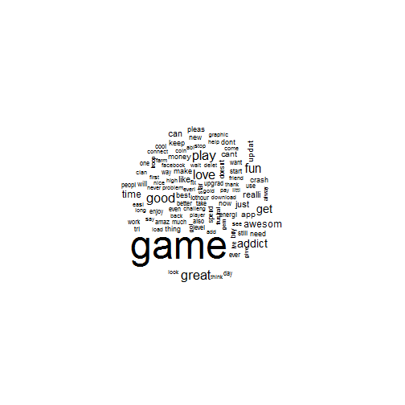
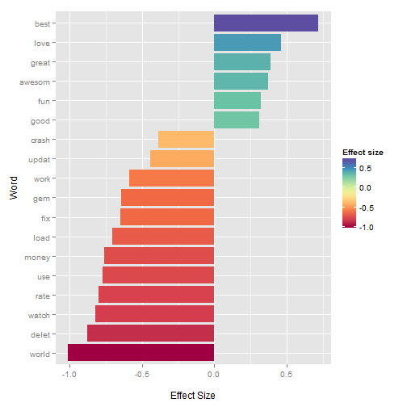

Text Mining with the tm Library
========================================================
author: Mhairi McNeill
date: 16/09/2015


```r
library(tm)
```


What I'll cover
========================================================

- Loading in the data
- Cleaning text
- Making a document-term matrix
- Where you can go from there


Loading in Data
========================================================

- First make a source object
- Then a corpus object 


```r
reviews <- read.csv("reviews.csv", stringsAsFactors=FALSE)

review_source <- VectorSource(reviews$text)
corpus <- Corpus(review_source)
```


Cleaning
========================================================


```r
inspect(corpus)
```

```
[1] " SO ADDICTING  DEFF DOWNLAOD ITS EPIC YOU CAT LOVERS WILL FALL IN LOVE <3"
```

Cleaning - to lowercase
========================================================


```r
corpus <- tm_map(corpus, content_transformer(tolower))
inspect(corpus)
```

```
[1] " so addicting  deff downlaod its epic you cat lovers will fall in love <3"
```


Cleaning - removing punctuation
========================================================


```r
corpus <- tm_map(corpus, removePunctuation)
inspect(corpus)
```

```
[1] " so addicting  deff downlaod its epic you cat lovers will fall in love 3"
```

Cleaning - removing white space
========================================================


```r
corpus <- tm_map(corpus, stripWhitespace)
inspect(corpus)
```

```
[1] " so addicting deff downlaod its epic you cat lovers will fall in love 3"
```

Cleaning - removing stop-words
========================================================


```r
corpus <- tm_map(corpus, removeWords, stopwords("english"))
inspect(corpus)
```

```
[1] "  addicting deff downlaod  epic  cat lovers will fall  love 3"
```

Cleaning - stemming 
========================================================


```r
corpus <- tm_map(corpus, stemDocument)
inspect(corpus)
```

```
[1] "  addict deff downlaod  epic  cat lover will fall  love 3"
```


Making a Document Term Matrix
========================================================

- Can do document-term matrix
- or term-document matrix


```r
dtm <- DocumentTermMatrix(corpus)
tdm <- TermDocumentMatrix(corpus)
```


Finding most frequent words
========================================================


```r
frequency <- colSums(as.matrix(dtm))
frequency <- sort(frequency, decreasing=TRUE)
head(frequency)
```

```
 game  play great   fun  good  love 
  976   250   249   241   238   234 
```


Making a word cloud
========================================================


```r
library(wordcloud)
wordcloud(names(frequency)[1:100], frequency[1:100])
```

 


Finding Correlated Words
========================================================


```r
findAssocs(dtm, terms = c('game', 'broke', 'cat'), corlimit = 0.2)
```

```
$game
  play player   dont    new    say   ever   that 
  0.29   0.22   0.21   0.21   0.21   0.20   0.20 

$broke
somepeopl   probabl   cheaper      cash     place       add 
     1.00      0.76      0.71      0.63      0.30      0.25 

$cat
    deff downlaod    lover     epic     fall 
     1.0      1.0      1.0      0.5      0.5 
```


Removing sparse terms
========================================================


```r
dim(dtm)
```

```
[1] 1000 2250
```

```r
dtm_small <- removeSparseTerms(dtm, 0.99)
dim(dtm_small)
```

```
[1] 1000  205
```


Making a linear model 
========================================================


```r
model <- lm(reviews$rating ~ .,
            data = as.data.frame(as.matrix(dtm_small)))
```

Making a linear model 
========================================================

 

Top Terms for each country 
========================================================


```r
by_country <- 
  reviews %>%
  group_by(location) %>%
  summarise(text = paste(text, collapse = ' '))

review_source <- VectorSource(by_country$text)
corpus <- Corpus(review_source)
```

Top Terms for each country 
========================================================


```
$au
 [1] "game"      "great"     "good"      "love"      "fun"      
 [6] "awesome"   "get"       "can"       "addictive" "play"     

$gb
 [1] "game"      "good"      "great"     "fun"       "addictive"
 [6] "love"      "get"       "really"    "time"      "app"      

$nz
 [1] "game"    "good"    "love"    "awesome" "fun"     "great"   "play"   
 [8] "really"  "like"    "time"   

$us
 [1] "game"   "fun"    "love"   "great"  "play"   "get"    "like"  
 [8] "just"   "good"   "really"
```


